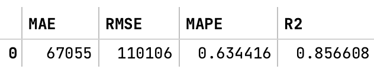

# Анализ временного ряда

### Модель прогноза v2.0

Для прогноза была использована гибридная модель, создающая $n$ моделей для предсказания и использующая новые
предсказания в модели в качестве фичей.

Ниже описана схема работы.


За основу была взята модель градиентных бустингов в реализации catboost.

---

### Фичи

- Реализовано скользящее среднее для всех колонок
- Реализовано извлечение помесячного среднего и извлечение функции от номера месяца

### Модель

состоит из 4-х классов:

- ```ModelBuilderUtils``` – для отрисовки и предобработки

- ```ModelBuilderFeatureExtractor``` – для извлечения фичей

- ```ModelBuilder``` – в нем содержится основная логика построения прогноза

- ```Model``` – построение прогноза и оценка метрик

---

### Метрики

Для оценки качества был взят 2016 год. Результаты модели на тесте.
Это на 2% хуже, чем в v1.0 модели. Возможно, связано с тем, что слишком маленький датасет, поэтому сложная модель
переобучается. Так же различие слишком маленькое, нужно проверять на стат. значимость.

### Feature importance


---

### Результаты

- Предикты на целевые даты можно найти в папке output
- feature importance можно найти в папке output
- Код модели – в ```main.ipynb```

---

### Идеи для доработки

- Реализовать и взять за основу / добавить в качестве фичей:
  - Предсказания LSTM
  - Предсказания трансформеров
  - Предсказания классических подходов ARIMA, Prophet, Etma
- Реализовать минорные улучшения
  - Реализовать кросс-валидацию
  - Реализовать grid-search по параметрам
  - Добавить больше даты из интернета
  - Извлечь доменные фичи на основе текущих фичей
